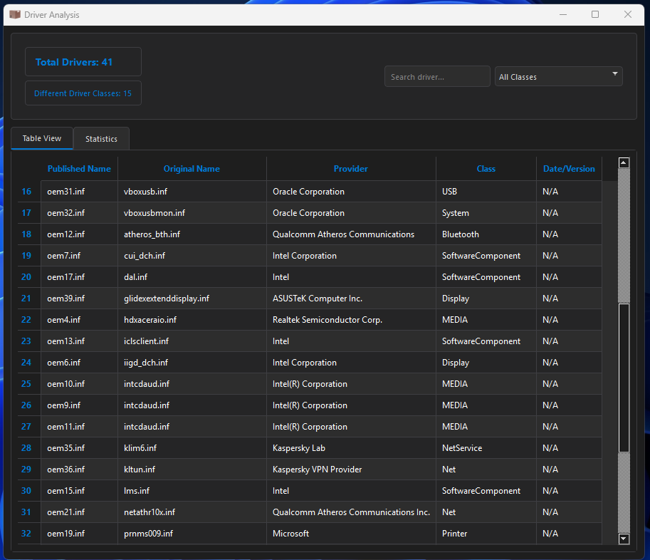

<a href="#">
    
</a>

# WSY - Windows Sürücü Yöneticisi
Windows Sürücülerini Yedekleyen ve Geri Yüklemeyi Sağlayan Profesyonel Bir Sürücü Yönetim Aracıdır.

<h1 align="center">GiPac Logo</h1>

<p align="center">
  
</p>

----------------------------------

# Windows Ekran Görüntüleri
  
  


 
  
  
--------------------

# Windows'a doğrudan yüklemek için

Windows Installer CMD (PowerShell): Doğrudan Bağlantı ile Windows CMD'den Yüklemek İçin.
```bash
powershell -Command "Invoke-WebRequest -Uri 'https://github.com/cektor/WSY/releases/download/1.0.1/Setup_Win64.exe' -OutFile 'Setup_Win64.exe'" && start /wait Setup_Win64.exe
```


Yayın Sayfası: https://github.com/cektor/WSY/releases/tag/1.0.1
