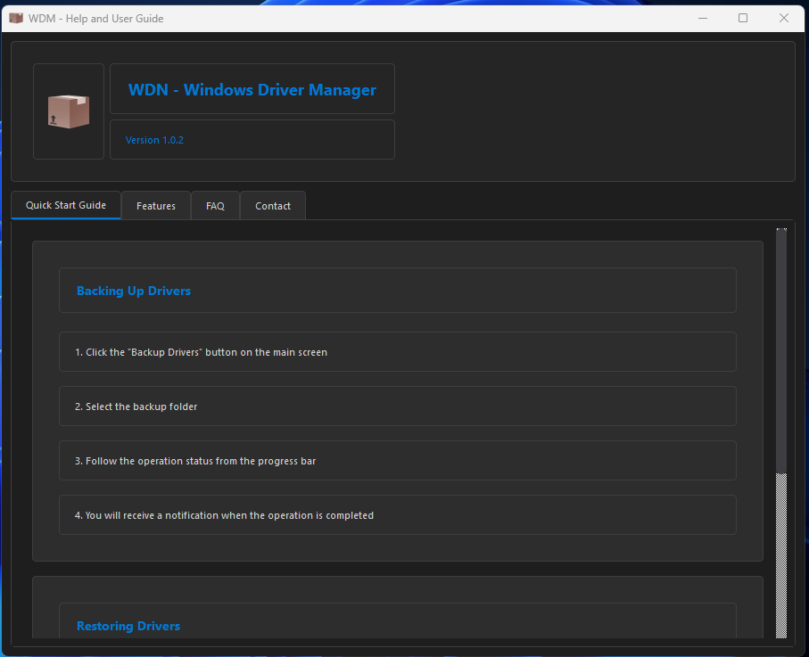

<a href="#">
    
</a>

# WDM - Windows Driver Manager
A professional driver management tool that backs up and restores Windows drivers.

<h1 align="center">WDM Logo</h1>

<p align="center">
  
</p>

----------------------------------

# Windows Screenshots
  
  


 
  
  
--------------------

# To install directly on Windows

Windows Installation via CMD (PowerShell): Installing Windows Directly from the Command Prompt.
```bash
powershell -Command "Invoke-WebRequest -Uri 'https://github.com/cektor/WDM/releases/download/1.0.1/Setup_Win64.exe' -OutFile 'Setup_Win64.exe'" && start /wait Setup_Win64.exe
```


Yayın Sayfası: https://github.com/cektor/WDM/releases/tag/1.0.1
